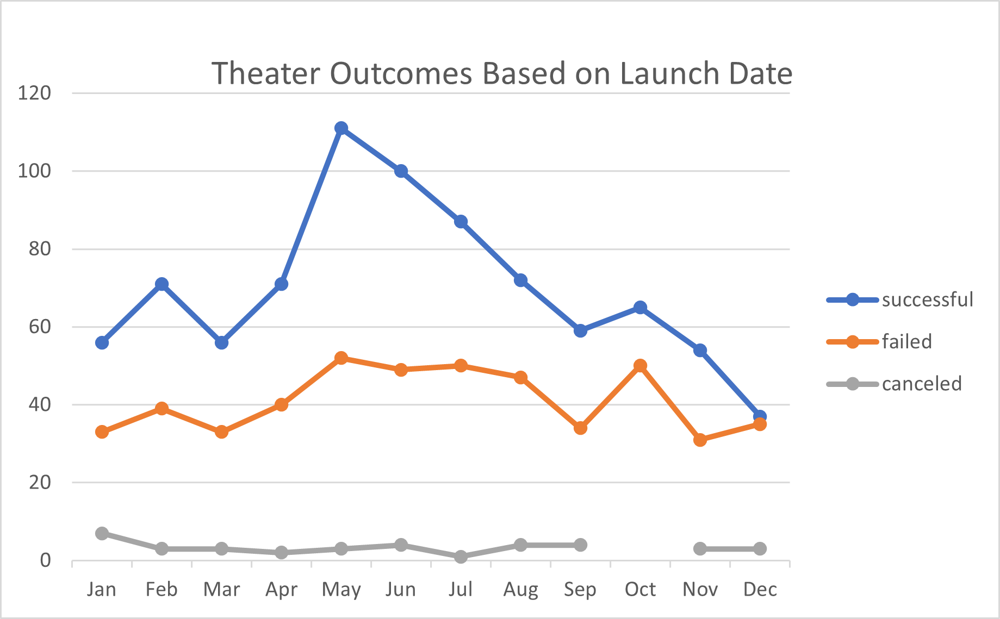

#An Analysis of Kickstarter Trends

##Overview

	The purpose of this analysis is to determine the most favorable conditions for achieving a successful Kickstarter campaign.
From among a wide array of different Kickstarter campaigns, we have chosen to focus on theatrical plays as they are most relevant to Louise's campaign.

##Analysis and Challenges

	By analyzing Theater outcomes,

##Results

	One of the most notieceable trends of the data is that the majority of successful campaigns being in late spring and early summer.

