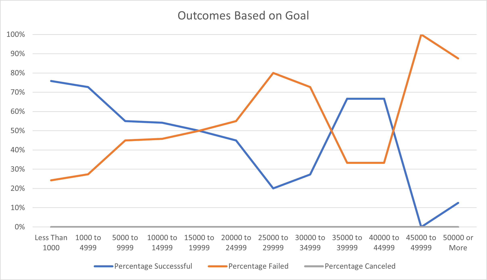

#An Analysis of Kickstarter Trends

##Overview

The purpose of this analysis is to determine the most favorable conditions for achieving a successful Kickstarter campaign.
From among a wide array of different Kickstarter campaigns, we have chosen to focus on theatrical plays as they are most relevant to Louise's campaign.

##Analysis and Challenges

By filtering pivot data on Theater outcomes, we have determined a correlation between launch month and goal attainment.

The screenshot above should reflect the volume of highest and lowest numbers of successful campaigns by launch month.

Additionally, by charting the goals based on ranges, we can see trends in outcome.

The above data illustrates the goal ranges that trend toward success, measured by percentage rate.

Initially, the data was utilizing Category and Subcategory as one component, but using Excel functionality we were able to 
separate the data into subcategories, which served as a much more useful tool in assessing campaign successes.

##Results

###Outcomes by Month

One of the most noticeable trends of the data is that the majority of successful campaigns begin in late spring and early summer.
The above screenshots highlight the success of campaigns that begin in April through July - with May launches being the most successful of all.

Additionally, the data illustrates the failure of productions that begin during the fall and winter months.  In particular, the month of December 
seems to have the lowest number of successes.  While October boasts slightly higher success rates than the other fall/winter months, it also has 
a correspondingly higher failure rate.  Essentially, the most successful campaigns begin in May with the least successful beginning in December.

###Outcomes by Goal

Another key takeaway from the data is the rate of success based on Goal.  The greatest rates of failure occur for those campaigns
 with goals above $45,000, with a similarly low success rate for those with goals of $25,000 to $30,000.  Most importantly the two highest rates
 of success occur when the goal is less than $5,000, and when it is between $35,000 and $45,000.

###Limitations and Additional Analysis

Additional research can be done comparing the launch month alongside goal amount.  Seperately, we can additionally graph successes based on country of origin.
Furthermore, one limit of the data is the dollar value of contributions themselves.  While we can determine average contribution per backer, we cannot determine if particular backers 
pledged outsized amounts in comparison, let alone which backers were key contributors.